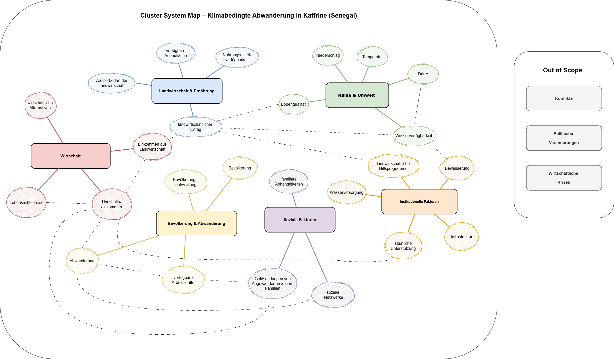
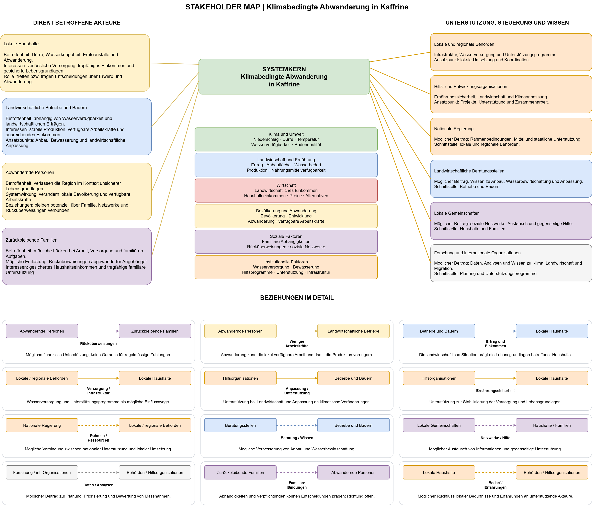
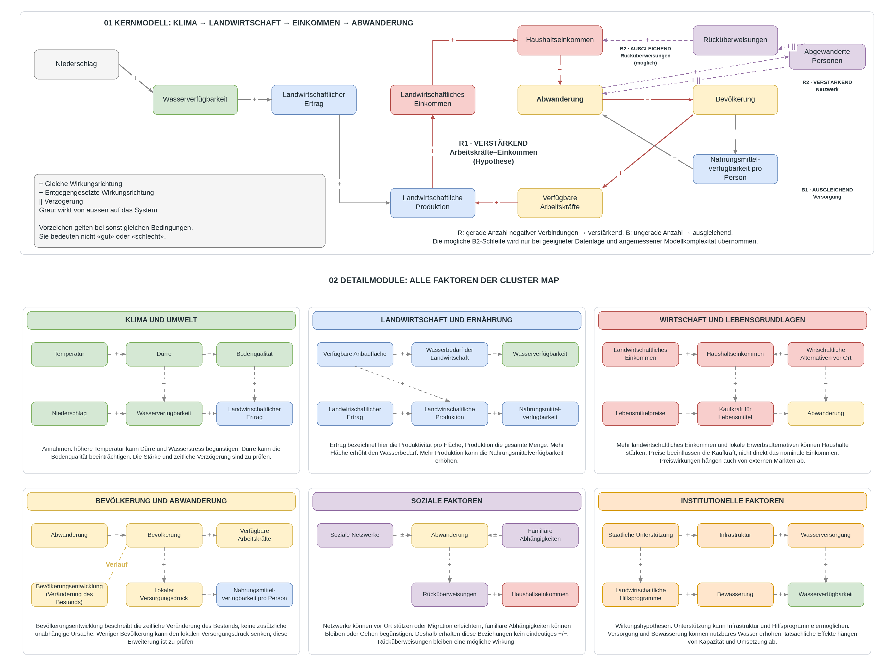
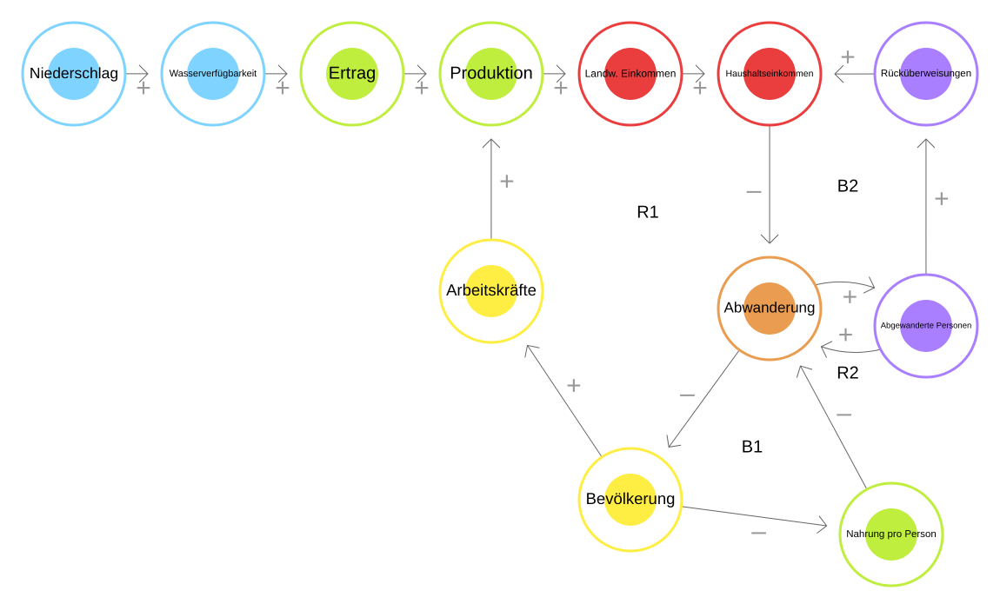
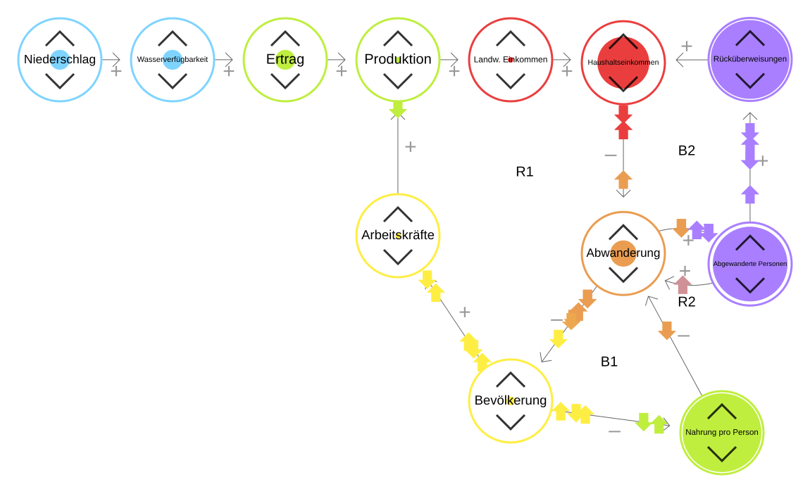

# **LE1 – Systemkarte: Klimabedingte Abwanderung aus Kaffrine**

## **1. Leitfrage**

>Wie wirken sich Dürren über Wasserverfügbarkeit, Ernte und Einkommen auf die Abwanderung aus der Region Kaffrine (Senegal) aus, und wie wirkt die Abwanderung auf Bevölkerung, Landwirtschaft >und Versorgung in der Region zurück?

## **2. Systemgrenzen**

### **Ort**

Region Kaffrine im Senegal (Sahel-Zone) und die Menschen, die von dort wegziehen. Nicht betrachtet werden Zielorte, Zuwanderung, Rückkehr, Konflikte, Politik und Wirtschaftskrisen.

### **Zeitraum**

| Zeitraum | Zweck |
|---|---|
| 2002–2023 | Modell mit echten Daten vergleichen (Backtest) |
| 2024–2050 | Szenarien für die Zukunft |

Der Zeitraum richtet sich nach den Daten, die wir gefunden haben:

| Grösse | Quelle | Was es gibt |
|---|---|---|
| Niederschlag | CHIRPS v2.0 (Satelliten- und Stationsdaten) | jährlich ab 1981 |
| Bevölkerung | ANSD (Statistikamt Senegal), Volkszählungen; Werte z.B. bei citypopulation.de | 2002, 2013, 2023 (Kaffrine 2013: 566 992, 2023: 820 405) |
| Abwanderung | ANSD, Volkszählung 2023, Kapitel Migration | nur Momentaufnahmen, z.B. 27 588 Wegzüge aus Kaffrine in den letzten 5 Jahren (innerhalb Senegals) |
| Landwirtschaft | ANSD, Regionalbericht Kaffrine 2022–2023; FAOSTAT für ganz Senegal | regional: Zeitreihe noch zu prüfen; national ab 1961 |

Ab 2002 gibt es drei Volkszählungen und lückenlose Niederschlagsdaten. Für die Abwanderung gibt es keine Zeitreihe; der Vergleich mit echten Daten läuft deshalb vor allem über die Bevölkerung.

## **3. Cluster System Map**

Die Cluster System Map sammelt alle Faktoren, die zu Beginn wichtig erschienen, und ordnet sie nach Themen.

### **Von der Cluster Map zur Causal Loop Map**

Alle Faktoren der Cluster Map stehen in Teil 02 der Causal Loop Map (Detailmodule). In Teil 01 (Kernmodell), das wir in LE2 simulieren, haben wir nur die wichtigsten übernommen:

| Faktor | Im Kernmodell? | Warum |
|---|---|---|
| Niederschlag | ja, von aussen vorgegeben | wichtigster Klimatreiber, gut messbar |
| Wasserverfügbarkeit, Ertrag, Produktion, Einkommen, Bevölkerung, Arbeitskräfte, Abwanderung | ja | Kern der Leitfrage |
| Nahrungsmittelverfügbarkeit pro Person | ja | zeigt die Versorgung der Region (Schleife B1) |
| Soziale Netzwerke | ja, als «Abgewanderte Personen» | Netzwerke entstehen durch bereits Weggezogene, diese lassen sich zählen (Schleife R2) |
| Rücküberweisungen | ja | Schleife B2 |
| Dürre | nein | ist zu wenig Niederschlag, würde denselben Effekt doppelt zählen |
| Temperatur, Boden, Anbaufläche, Wasserbedarf | nein | wirken indirekt oder langsam, Anbaufläche als gleichbleibend angenommen |
| Lebensmittelpreise, Kaufkraft, wirtschaftliche Alternativen | nein | hängen von Märkten ausserhalb ab, als gleichbleibend angenommen |
| Familiäre Abhängigkeiten | nein | Wirkung unklar: können zum Bleiben oder zum Gehen führen |
| Behörden, Hilfsprogramme, Bewässerung | nein | mögliche Massnahmen, werden in LE4 als Szenarien getestet |

## **4. Stakeholder Map**

Unten in der Karte sind die Akteure nach Einfluss und Betroffenheit eingeordnet (neu gegenüber der ersten Version `vorlaeufersystemkarten/stakeholder_map_v1.png`). Regierung, Behörden und Hilfsorganisationen können viel bewirken, tragen die Folgen aber kaum selbst. Sie sind die Ansprechpartner für die Massnahmen in LE4.

## **5. Causal Loop Map**

Teil 01 ist das Kernmodell, das wir in LE2 simulieren. Teil 02 zeigt alle Faktoren der Cluster Map. R = verstärkende Schleife, B = ausgleichende Schleife.

### **Änderungen gegenüber der ersten Version**

Teil 02 ist unverändert. Im Kernmodell haben wir gegenüber der ersten Version `vorlaeufersystemkarten/causal_loop_map_v1.png` geändert:

| Änderung | Warum |
|---|---|
| Dürre entfernt, Niederschlag grau | Dürre und Niederschlag zählten denselben Effekt doppelt. |
| Ertrag → Produktion statt Ertrag → Einkommen | Der Ertrag pro Hektar wirkt über die gesamte Ernte auf das Einkommen. |
| Landw. Einkommen → Haushaltseinkommen statt landw. Einkommen → Abwanderung | Vorher zeigten zwei Einkommen direkt auf die Abwanderung. Das zählte das Einkommen doppelt. |
| Bevölkerung → Arbeitskräfte statt Abwanderung → Arbeitskräfte | Wer wegzieht, verringert zuerst die Bevölkerung, erst dadurch die Arbeitskräfte. |
| Neu: Abgewanderte Personen, Schleife R2 | Wer schon weg ist, hilft anderen beim Wegziehen. |
| Rücküberweisungen kommen von den Abgewanderten Personen (B2) | Geld schicken alle, die schon weg sind, nicht nur die, die dieses Jahr gehen. |
| Neu: Nahrungsmittelverfügbarkeit pro Person, Schleife B1 | zeigt die Rückwirkung der Abwanderung auf die Region |
| Verzögerungen (\|\|) markiert, Schleifen nummeriert | Vorbereitung für LE2 |

### **Schleifen**

| Schleife | Art | Ablauf | Was passiert |
|---|---|---|---|
| R1 Arbeitskräfte–Einkommen | verstärkend (Vermutung) | Abwanderung → Bevölkerung (−) → Arbeitskräfte (+) → Produktion (+) → landw. Einkommen (+) → Haushaltseinkommen (+) → Abwanderung (−) | Wer wegzieht, fehlt als Arbeitskraft. Die Ernte sinkt, das Einkommen auch, und noch mehr Menschen ziehen weg. |
| R2 Netzwerk | verstärkend, verzögert | Abwanderung → Abgewanderte Personen (+) → Abwanderung (+) | Wer schon weg ist, erleichtert anderen das Wegziehen. |
| B1 Versorgung | ausgleichend | Abwanderung → Bevölkerung (−) → Nahrung pro Person (−) → Abwanderung (−) | Weniger Menschen heisst mehr Nahrung pro Person. Der Druck wegzuziehen sinkt. |
| B2 Rücküberweisungen | ausgleichend, verzögert | Abwanderung → Abgewanderte Personen (+) → Rücküberweisungen (+) → Haushaltseinkommen (+) → Abwanderung (−) | Geld von Abgewanderten hilft den Familien. Weniger Menschen müssen wegziehen. |

R1 und B1 beginnen beide bei der sinkenden Bevölkerung, wirken aber gegeneinander. Welche Schleife stärker ist, untersuchen wir in LE2.

### **Exploration in Loopy**

Das Kernmodell ist in Loopy nachgebaut. Darin sieht man, wie sich eine Veränderung durch die Schleifen ausbreitet.

**Modell**

**Experiment Dürre** (Niederschlag einmal gesenkt)

- Über Wasser, Ernte und Einkommen steigt die Abwanderung, und die Zahl der abgewanderten Personen wächst.
- Mit R2 steigt die Abwanderung deutlich stärker als ohne (Vergleich: Pfeil «Abgewanderte Personen → Abwanderung» entfernt).
- Danach schwanken die Werte, ohne zur Ruhe zu kommen. Welche Schleife langfristig überwiegt, kann Loopy nicht zeigen. Das untersuchen wir in LE2.

### **Grenzen der Karte**

**Einkommen und Abwanderung:** 
- Sehr arme Haushalte können sich das Wegziehen oft nicht leisten
- Mehr Einkommen kann deshalb zuerst sogar zu mehr Abwanderung führen. Das «−» zeigt den Normalfall

**R1 ist eine Vermutung:** 
- Im ländlichen Sahel gibt es oft mehr Arbeitskräfte als Arbeit
- Ob die Ernte sinkt, wenn Menschen wegziehen, ist unsicher
